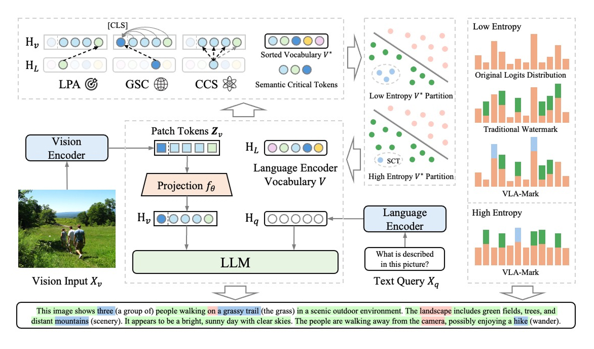

# VLA-Mark: A cross modal watermark for large vision-language alignment models
<div align="center">
Shuliang Liu<sup>1, 2</sup>, Qi Zheng<sup>1, 2</sup>, Jesse Jiaxi Xu<sup>3</sup>, Yibo Yan<sup>1, 2</sup>, He Geng<sup>1, 2</sup>, Aiwei Liu1<sup>1, 2</sup>
</div>
<div align="center">
Peijie Jiang<sup>4</sup>, Jia Liu<sup>4</sup>, Yik-Cheung Tam<sup>5</sup>, Xuming Hu<sup>1, 2</sup>
</div>
<div align="center">
<sup>1</sup> The Hong Kong University of Science and Technology (Guangzhou)
</div>
<div align="center">
<sup>2</sup> The Hong Kong University of Science and Technology
</div>
<div align="center">
<sup>3</sup> University of Toronto <sup>4</sup> Ant Group, Alibaba <sup>5</sup> New York University Shanghai
</div>

<div align="center">
    <a href="https://arxiv.org/abs/2507.14067"></a>
</div>

Vision-language models demand watermarking solutions that protect intellectual property without compromising multimodal coherence. Existing text watermarking methods disrupt visual-textual alignment through biased token selection and static strategies, leaving semantic-critical concepts vulnerable. We propose VLA-Mark, a vision-aligned framework that embeds detectable watermarks while preserving semantic fidelity through cross-modal coordination. Our approach integrates multiscale visual-textual alignment metrics, combining localized patch affinity, global semantic coherence, and contextual attention patterns, to guide watermark injection without model retraining. An entropy-sensitive mechanism dynamically balances watermark strength and semantic preservation, prioritizing visual grounding during low-uncertainty generation phases. Experiments show 7.4% lower PPL and 26.6% higher BLEU than conventional methods, with near perfect detection (98.8% AUC). The framework demonstrates 96.1% attack resilience against attacks such as paraphrasing and synonym substitution, while maintaining text-visual consistency, establishing new standards for quality-preserving multimodal watermarking 

<div align="center">
    
</div>

## 🏗️ Project Structure

```
VLA/
├── main.py                 # Main watermarking script
├── detection.py           # Watermark detection pipeline
├── vla.py                 # Core VLA watermarking implementation
├── mark_utils.py          # Utility functions for watermarking
├── run.sh                 # Main execution script
├── dataset/               # Dataset directory
│   └── amber/            # AMBER dataset
│       ├── image/        # Images for testing
│       └── query_generative.json  # Query dataset
└── result/               # Results and outputs directory
```

## 🚀 Quick Start

### Prerequisites

- Python 3.11
- PyTorch
- Transformers
- MarkLLM
- PIL (Pillow)
- pandas, numpy, scikit-learn
- tqdm

### Installation

```bash
# Clone the repository
git clone https://github.com/shiningwhite-cmd/VLA-mark.git
cd VLA-mark

# Install dependencies
pip install -r requirements.txt
```

### Dataset Setup

This project uses the AMBER (An LLM-free Multi-dimensional Benchmark for MLLMs Evaluation) dataset for evaluation. AMBER is a comprehensive benchmark designed to evaluate multimodal large language models (MLLMs) across multiple dimensions without relying on LLMs for assessment.

#### Download AMBER Dataset

Since the dataset folder is empty in the repository, you need to download the AMBER dataset manually:

```bash
# Create dataset directory structure
mkdir -p dataset/amber

# Download the query file
curl -o dataset/amber/query_generative.json https://raw.githubusercontent.com/junyangwang0410/AMBER/master/data/query/query_generative.json

# Download and setup images
# Clone AMBER repository to get download scripts
git clone https://github.com/junyangwang0410/AMBER.git temp_amber

# Follow AMBER's instructions to download images
cd temp_amber
# Download images according to AMBER's README instructions
# This typically involves downloading from cloud storage services

# Move images to the correct location
mv path/to/downloaded/images ../dataset/amber/image/

# Clean up temporary files
cd ..
rm -rf temp_amber
```

**Alternative manual setup:**

1. **Query file**: Download `query_generative.json` from: https://github.com/junyangwang0410/AMBER/blob/master/data/query/query_generative.json
2. **Images**: Follow the download instructions at: https://github.com/junyangwang0410/AMBER
   - Download the image files according to the AMBER repository instructions
   - Extract and place all images in `dataset/amber/image/` directory
   - Ensure images follow the naming convention: `AMBER_{ID}.jpg`

#### Verify Dataset Setup

```bash
# Check if dataset is properly set up
ls dataset/amber/
# Should show: image/ query_generative.json

# Check number of images (should be 1004 for full AMBER dataset)
ls dataset/amber/image/ | wc -l

# Verify query file format
head -5 dataset/amber/query_generative.json
```

### Basic Usage

#### 1. Set up environment variables

```bash
export MODEL_PATH=/path/to/your/model
```

#### 2. Generate watermarked responses

```bash
bash run.sh
```

Or run directly with Python:

```bash
python3 main.py \
    --json_path ./dataset/amber/query_generative.json \
    --image_dir ./dataset/amber/image \
    --model_path "${MODEL_PATH}" \
    --range_num 1004 \
    --model_name llava \
    --task_name AMBER \
    --data_suffix .jpg \
    --similarity_scheme cosine \
    --max_tokens 100 \
    --min_tokens 90
```

## 📊 Evaluation Metrics

The system provides comprehensive evaluation metrics:

- **ROC AUC**: Area Under the ROC Curve
- **F1 Score**: Harmonic mean of precision and recall
- **Accuracy**: Overall detection accuracy
- **TPR/FPR**: True/False Positive Rates
- **TNR/FNR**: True/False Negative Rates

## 🎯 Supported Models

### LLaVA (Large Language and Vision Assistant)
- Model: `llava-1.5-7b-hf`
- Vision tower integration
- Multi-modal projector support

### Qwen2-VL
- Model: `Qwen2-VL-7B-Instruct`
- Advanced vision-language capabilities
- Device mapping support

## 📁 Dataset Format

### Query Dataset (`query_generative.json`)

```json
[
    {
        "id": 1,
        "image": "AMBER_1.jpg",
        "query": "Describe this image."
    },
    {
        "id": 2,
        "image": "AMBER_2.jpg",
        "query": "Describe this image."
    }
]
```

### Image Dataset

- Images should be placed in the specified `image_dir`
- Supported formats: JPG, PNG
- Naming convention: `{TASK_NAME}_{ID}{DATA_SUFFIX}`

## 🤝 Contributing

Contributions are welcome! Please follow these guidelines:

1. Fork the repository
2. Create a feature branch
3. Make your changes
4. Add tests if applicable
5. Submit a pull request

## 📄 License

This project is licensed under the MIT License - see the LICENSE file for details.

## 🔗 References

- [LLaVA: Large Language and Vision Assistant](https://llava-vl.github.io/)
- [Qwen2-VL: Enhancing Vision-Language Model's Perception of the World at Any Resolution](https://qwenlm.github.io/blog/qwen2-vl/)
- [AMBER: An LLM-free Multi-dimensional Benchmark for MLLMs Evaluation](https://arxiv.org/abs/2311.07397) - Wang et al., 2023
- [AMBER GitHub Repository](https://github.com/junyangwang0410/AMBER) - Official dataset and evaluation tools

## 📧 Contact

For questions, issues, or collaboration opportunities, please open an issue on GitHub.

---

**Note**: This is a research project focused on watermarking for vision-language models. Please ensure responsible use and compliance with applicable regulations and ethical guidelines.
>>>>>>> 06fcfaf (init)
